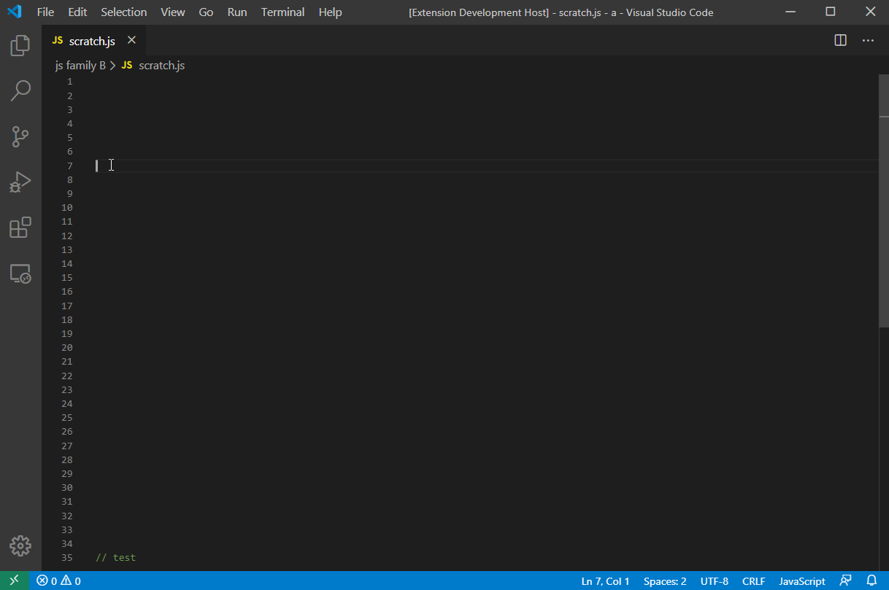
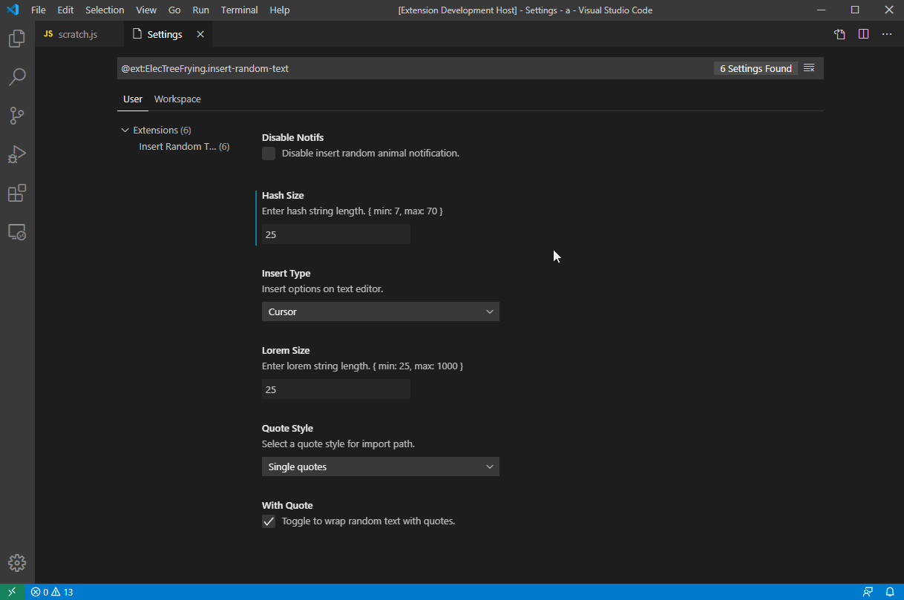

# Insert Random Text (vscode extension)

<!-- [![Current version of Insert Random Text][version svg]][package] [![Current downloads of Insert Random Text][downloads svg]][package] [![Current ratings of Insert Random Text][ratings svg]][package] -->

Insert random text on the fly.

## Usage

1. On your text editor.
1. From the command palette `Ctrl+Shift+P`
1. Select any Insert Random command

## Commands

| Command                     | Description                                         |
| --------------------------- | --------------------------------------------------- |
| Insert Random: Animal       | Insert random animal                                |
| Insert Random: Person       | Insert random name                                  |
| Insert Random: Date         | Insert random date                                  |
| Insert Random: Country      | Insert random country                               |
| Insert Random: Number       | Insert random number                                |
| Insert Random: string       | Insert random string                                |
| Insert Random: lorem        | Insert lorem (configure length in settings)         |
| Insert Random: Lorem Small  | Insert lorem, Length 177                            |
| Insert Random: Lorem Medium | Insert lorem, Length 521                            |
| Insert Random: Lorem Large  | Insert lorem, Length 1368                           |
| Insert Random: hash         | Insert random hash (configure length in settings    |
| Insert Random: Hash Small   | Insert random, Length 7                             |
| Insert Random: Hash Medium  | Insert random, Length 17                            |
| Insert Random: Hash Large   | Insert random, Length 27                            |

## Extension Settings

### General settings

* `quoteStyle`: (double/single quote) Select quote style for path.
* `insertType`: Paste import on selected line at the top or on selected line.
* `loremSize`: Enter lorem string length..
* `hashSize`: Enter hash string length..
* `disableNotifs`: Disable all notifications on file drop to active pane.
* `withQuote`: Toggle to wrap random text with quotes.
* `withNewLine`: Toggle include newline at the end of each insert.

### Settings Preview

## Installation

  1. Install Visual Studio Code v1.30.0 or higher
  1. Launch Code
  1. From the command palette `Ctrl+Shift+P` (Windows, Linux) or `Cmd+Shift+P` (OSX)
  1. Select Install Extensions.
  1. Choose **Insert Random** Text by _ElecTreeFrying_
  1. Reload Visual Studio Code

## Changelog

See [CHANGELOG] for more information.

## Contributing

* File bugs, feature requests in [GitHub Issues].
* Leave a review on [Visual Studio Marketplace].

## Related

[More extensions of mine.]

## License

MIT

[version svg]: https://vsmarketplacebadge.apphb.com/version/ElecTreeFrying.insert-random-text.svg
[downloads svg]: https://vsmarketplacebadge.apphb.com/downloads/ElecTreeFrying.insert-random-text.svg
[ratings svg]: https://vsmarketplacebadge.apphb.com/rating-short/ElecTreeFrying.insert-random-text.svg
[package]: https://marketplace.visualstudio.com/items?itemName=ElecTreeFrying.insert-random-text

[VS Code]: https://code.visualstudio.com/
[extension]: https://marketplace.visualstudio.com/VSCode

[CHANGELOG]: https://marketplace.visualstudio.com/items/ElecTreeFrying.insert-random-text/changelog
[Github Issues]: https://github.com/ElecTreeFrying/insert-random-text/issues
[Visual Studio Marketplace]: https://marketplace.visualstudio.com/items?itemName=ElecTreeFrying.insert-random-text&ssr=false#review-details
[More extensions of mine.]: https://marketplace.visualstudio.com/publishers/ElecTreeFrying
