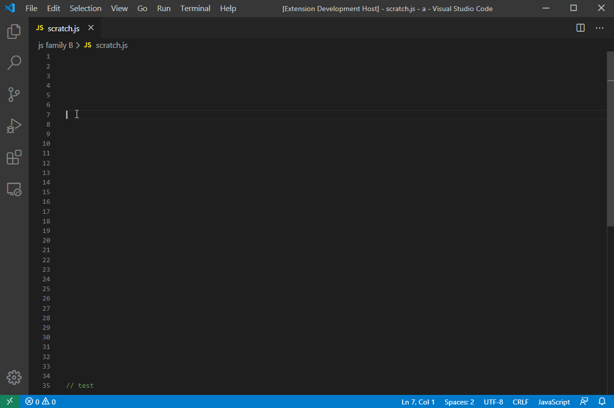

# Random & Fake Data Generator

[![version][version svg]][package]
[![installs][installs svg]][package]
[![downloads][downloads svg]][package]
[![ratings][ratings svg]][package]
[![license][license svg]][repo]
[![vscode][vscode svg]][package]

[version svg]: https://vsmarketplacebadges.dev/version-short/electreefrying.insert-random-text.png
[installs svg]: https://vsmarketplacebadges.dev/installs/electreefrying.insert-random-text.png
[downloads svg]: https://vsmarketplacebadges.dev/downloads/electreefrying.insert-random-text.png
[ratings svg]: https://vsmarketplacebadges.dev/rating-short/ElecTreeFrying.insert-random-text.png
[license svg]: https://img.shields.io/github/license/ElecTreeFrying/insert-random-text
[vscode svg]: https://img.shields.io/badge/vscode-%3E%3D1.97.0-blue
[package]: https://marketplace.visualstudio.com/items?itemName=ElecTreeFrying.insert-random-text
[repo]: https://github.com/ElecTreeFrying/insert-random-text

> **Insert random & fake data — at every cursor.**

**Names** · **Emails** · **Addresses** · **Numbers** · **Dates** · **UUIDs** · **Lorem ipsum** · **Mock JSON**

Generate realistic fake data right where you're typing — no website, no signup, fully offline. Drop a multi-cursor selection down a column and fill every row with a _different_ value in one step.

---

## Quick Start

1. **Install** the extension ([see below](#installation)).
2. Open the Command Palette — <kbd>Cmd</kbd>/<kbd>Ctrl</kbd>+<kbd>Shift</kbd>+<kbd>P</kbd>.
3. Run **Insert Random: Pick…** to choose from the full catalog, or run a specific `Insert Random:` command directly.
4. Place **multiple cursors** first to fill many spots at once — each gets its own value.

---

## Highlights

- **Fill every cursor at once** — a _different_ value at each cursor in a single step. The fastest way to seed a table, an array, or a fixture.
- **Stays in your editor** — fully offline, no account, no copy-paste from a website.
- **Reproducible when you need it** — set a seed and get the same data every run for stable tests and snapshots.
- **Drops straight into code** — optional quote-wrapping and trailing newline so values land cleanly in arrays, JSON, and configs.
- **Powered by [Faker][faker]** — realistic, coherent names, emails, and addresses, not random noise.

[faker]: https://fakerjs.dev

---

## What it generates

| Category | Examples |
|---|---|
| **Identity** | full name, first / last name, username, email |
| **Numbers** | integer (with range), boolean |
| **Text** | string, lorem ipsum (words / sentences / paragraphs) |
| **Time** | dates and timestamps |
| **Location** | country, city, address |
| **Network & IDs** | UUID, hash, IP, MAC, URL, color |

_…and growing every release._

---

## Settings

| Setting | Description |
|---|---|
| `insertRandomText.uniquePerCursor` | A different value at each cursor (multi-cursor fill), or the same value repeated. |
| `insertRandomText.seed` | A number for reproducible output — the same seed yields the same values. |
| `insertRandomText.bulkCount` | How many values to insert at each cursor. |
| `insertRandomText.outputFormat` | `plain`, `jsonArray`, or `quotedList`. |
| `insertRandomText.contextMenu.enabled` | Add an "Insert Random" submenu to the editor right-click menu. |
| `withQuote` | Wrap each inserted value in quotes. |
| `withNewLine` | Append a newline after each value. |
| `quoteStyle` | Single or double quotes. |
| `insertType` | Insert at each cursor, or at the top of the file. |

---

## Installation

**Requires VS Code 1.97.0 or later.**

- **Marketplace:** Extensions view (<kbd>Cmd</kbd>/<kbd>Ctrl</kbd>+<kbd>Shift</kbd>+<kbd>X</kbd>) → search **Random & Fake Data Generator** by _ElecTreeFrying_ → **Install**.
- **CLI:** `code --install-extension ElecTreeFrying.insert-random-text`
- **Direct:** [VS Code Marketplace listing][package]

---

## Compatibility

- **VS Code** 1.97.0 or later.
- **Compatible hosts:** Cursor, VSCodium, Code Server, and other forks that implement the VS Code API at the same engine version.
- **Platforms:** macOS, Windows, Linux.
- **Privacy:** No network calls, no telemetry — every value is generated locally.

---

## Troubleshooting

If a command doesn't insert, or a value looks wrong, please open an issue on [GitHub Issues][issues].

[issues]: https://github.com/ElecTreeFrying/insert-random-text/issues

---

## Changelog

See [CHANGELOG.md][changelog] for full release notes.

[changelog]: CHANGELOG.md

---

## Contributing

Contributions, bug reports, and feature requests are welcome in [GitHub Issues][issues].

---

## Support

**This extension is free and always will be.** If it's become part of your workflow, here are a few ways to give back:

- Star the repo on [GitHub][repo]
- Leave a review on the [VS Code Marketplace][reviews]
- Send a donation to any address below

[reviews]: https://marketplace.visualstudio.com/items?itemName=ElecTreeFrying.insert-random-text&ssr=false#review-details

| Network | Address |
|---|---|
| **Bitcoin** | `bc1q4j2uewfphjmca83905qv37vcl4jh8va5yupl7w` |
| **Solana** | `EHtTGyRoDAK44KBGrEoypAWyPpResHUqwufKnuLs7Tyy` |
| **Sui** | `0xcaf8ff4a65d7e35d961abd0203180013b7fe974d4fa0313e880c39c45ada2b09` |
| **ERC-20** (Ethereum / Base / Monad / Polygon / HyperEVM) | `0xd25f84Ed2F76dF2F0C8f1207402eF9e15b5d7855` |

---

## Related

- **[All extensions by ElecTreeFrying][all]** on the VS Code Marketplace.

[all]: https://marketplace.visualstudio.com/publishers/ElecTreeFrying

---

## License

[MIT][license]

[license]: https://marketplace.visualstudio.com/items/ElecTreeFrying.insert-random-text/license
